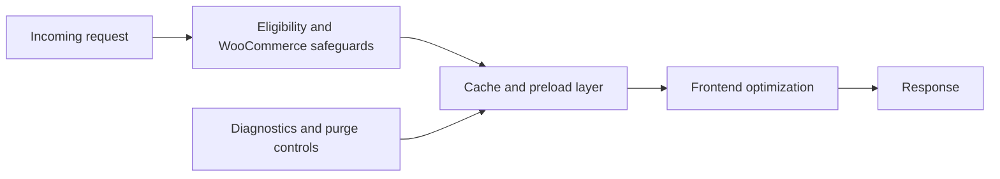

# UltraCache Pro — WordPress Performance & Caching

> **Portfolio project · WordPress/PHP · caching · Core Web Vitals · WooCommerce · frontend optimization**

UltraCache Pro is a modular WordPress performance plugin focused on safe caching and front-end optimization. It combines full-page caching, preload, CSS/JavaScript optimization, media optimization, diagnostics and WooCommerce-aware safeguards.

**Developer profile:** [Andrew Baeten](https://github.com/Yolol100) · [Portfolio cases](https://andrewbaeten.nl/category/cases)

## What problem it solves

Performance work often involves multiple interacting systems: page cache, browser cache, CSS/JS processing, images, fonts, object cache, CDN behaviour and dynamic WooCommerce routes. UltraCache Pro brings those concerns into one controlled plugin while keeping higher-risk optimizations staging-first and reversible.

## Portfolio snapshot

| Area | What it demonstrates |
| --- | --- |
| WordPress performance | Full-page caching, preload, browser caching and object-cache integration |
| Front-end optimization | CSS, JavaScript, fonts, media, WebP/AVIF and responsive image handling |
| WooCommerce safety | Cart, checkout, account and session-aware cache safeguards |
| Reliability | Queueing, retries, stale-cache handling, bounded cleanup and fail-safe defaults |
| Diagnostics | Cache insights, purge history, support reports and Core Web Vitals sampling |
| Security | Input validation, signed compatibility overlays, secret redaction and safe filesystem boundaries |

## Workflow at a glance

## Safe operating model

- Start with conservative caching and media settings.
- Introduce advanced CSS/JavaScript processing separately on staging.
- Verify representative templates, forms, consent tools and logged-in behaviour.
- For WooCommerce, test product, cart, checkout, order and account flows before production rollout.
- Avoid running multiple tools that rewrite the same cache/CSS/JavaScript output without a documented compatibility plan.

## Requirements

- WordPress 6.3+
- PHP 8.0+
- Current stable version: see [`readme.txt`](readme.txt)

## Technical review

Key areas to inspect:

- `advanced-cache.php` — page-cache drop-in behaviour.
- `includes/` — runtime modules and performance features.
- `dropins/` — optional cache integrations.
- `compat/` — compatibility handling.
- [`COMPATIBILITY.md`](COMPATIBILITY.md) — supported integration boundaries.
- [`SECURITY.md`](SECURITY.md) — security and reporting policy.
- [`RELEASING.md`](RELEASING.md) — release process.

The full WordPress.org-style feature, installation, privacy and changelog documentation remains in [`readme.txt`](readme.txt).

## Verification

GitHub Actions now combines the PHP syntax matrix with clean WordPress activation/deactivation checks on the minimum supported WordPress release and WordPress 7.1. The runtime gate is intentionally narrow: it proves bootstrap compatibility without claiming that every caching, WooCommerce or front-end optimization path has been exercised.

See [PHP compatibility](.github/workflows/php-compatibility.yml) for the executable contract.

## About the developer

I am **Andrew Baeten**, a WordPress Developer with 10+ years of experience across **90+ WordPress projects** and ongoing responsibility for **120+ websites and webshops**. My work combines WordPress, WooCommerce, Elementor, UX, performance, technical SEO and quality-focused delivery.

[Portfolio cases](https://andrewbaeten.nl/category/cases) · [LinkedIn](https://www.linkedin.com/in/andrew-baeten-305a1478/) · [Email](mailto:info@andrewbaeten.nl)

## License

GPL-2.0-or-later. See [`LICENSE.txt`](LICENSE.txt).
